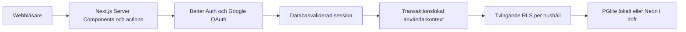

# Arkitektur

## Översikt

Next.js App Router ansvarar för UI, serverrendering och små server actions. Better Auth hanterar Google OAuth och lagrar sessioner i samma Postgres-schema som ekonomidatan. Drizzle är databasgränsen. Lokalt körs schemat i PGlite; i drift används Neon via en poolad Postgres-anslutning. Dashboardens nuvarande fixtures är en avgränsad prototyp och byts stegvis mot repository-funktioner som läser per hushåll.

## Säkerhetsgränser

- OAuth-hemligheter, auth-hemlighet och databasanslutningar finns endast på servern.
- Proxy-lagret gör bara en snabb cookie-kontroll. Skyddade sidor och mutationer validerar alltid sessionen mot Better Auths databas.
- Google-identiteten måste finnas i serverns e-postallowlist vid varje OAuth-inloggning.
- OAuth-token krypteras med Better Auth-hemligheten och OAuth-state förbrukas från databasen.
- Implicit kontolänkning är avstängd för att undvika att en ny leverantör automatiskt tar över ett konto med samma e-postadress.
- Alla hushållstabeller har tvingande RLS och separata policyer för select, insert, update och delete.
- Medlemskontroll ligger i ett `private`-schema. Hushållsdata nås genom `withAuthenticatedDatabase()`, som validerar sessionen och sätter `app.user_id` transaktionslokalt.
- Främmande nycklar och vanliga hushålls-/datumfrågor har index.
- Inga hemligheter eller verkliga ekonomidata ska checkas in.

## Anslutningar och migrationer

Applikationen återanvänder en liten pool och har prepared statements avstängda, vilket fungerar med Neons poolade transaktionsanslutning. `DATABASE_URL` använder en branchspecifik `home_economy_runtime`-roll utan admin- eller RLS-bypass. `DATABASE_MIGRATION_URL` använder ägarrollen och får endast användas för migrationer. Lokala migrationer använder samma SQL-filer mot PGlite, vilket gör scaffoldade projekt och tester oberoende av molnresurser.

Ett Neon-projekt i AWS Frankfurt äger de hostade miljöerna. Produktionsdatabasen ligger på rotbranchen `production`, den långlivade `development`-branchen används som staging och framtida PR-preview ligger på kortlivade `preview/pr-*`-branches. Branchspecifika anslutningar finns som secrets i motsvarande GitHub environment. Miljöbeslutet och de övervägda alternativen finns i [ADR 0001](adr/0001-data-and-auth-platform.md).

## Pengar och datum

Klientens domänfunktioner använder heltals-öre för exakta beräkningar. Databasen använder `numeric(14,2)`. Månadsperioder sparas som första dagen i månaden och valideras i databasen. Datum utan tid lagras som `date`; auditfält använder `timestamptz`.

## Nästa vertikala flöde

Den första persistenta funktionen bör vara “skapa månadsplan”: skapa hushåll, registrera inkomster och återkommande poster, generera månadens rader och visa kvar efter plan. Därefter kan historisk import och kontosnapshots läggas på utan att ändra kärnmodellen.
