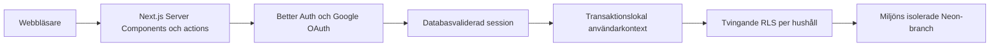

# Arkitektur

## Översikt

Next.js App Router ansvarar för UI, serverrendering och små server actions. Better Auth hanterar verifierad e-post/lösenord och Google OAuth samt lagrar sessioner i samma Postgres-schema som ekonomidatan. Drizzle är databasgränsen. Lokal apputveckling och drift använder isolerade Neon-branches via poolade Postgres-anslutningar. PGlite används endast för snabba tester och uttryckligt offline-läge. Dashboardens nuvarande fixtures är en avgränsad prototyp och byts stegvis mot repository-funktioner som läser per hushåll.

## Säkerhetsgränser

- OAuth-hemligheter, auth-hemlighet och databasanslutningar finns endast på servern.
- Proxy-lagret gör bara en snabb cookie-kontroll. Skyddade sidor och mutationer validerar alltid sessionen mot Better Auths databas.
- Alla Google-konton kan registrera sig. Efter den första inloggningen skapas ett eget ägarhushåll genom en autentiserad server action.
- Lösenordskonton kräver e-postverifiering. Google länkas automatiskt till ett befintligt konto endast när samma lokalt verifierade e-postadress matchar.
- OAuth-token krypteras med Better Auth-hemligheten och OAuth-state förbrukas från databasen.
- Vercels dynamiska previews använder Better Auths OAuth Proxy via den stabila produktionsdomänen. Endast en separat, kortlivad proxyhemlighet delas mellan Preview och Production; deras vanliga auth-hemligheter och databaser förblir separata.
- Verifierings- och återställningsmail skickas server-side via Resend; API-nyckeln exponeras aldrig för klienten.
- Alla hushållstabeller har tvingande RLS och separata policyer för select, insert, update och delete.
- Medlemskontroll ligger i ett `private`-schema. Hushållsdata nås genom `withAuthenticatedDatabase()`, som validerar sessionen och sätter `app.user_id` transaktionslokalt.
- Främmande nycklar och vanliga hushålls-/datumfrågor har index.
- Inga hemligheter eller verkliga ekonomidata ska checkas in.

## Anslutningar och migrationer

Applikationen återanvänder en liten pool och har prepared statements avstängda, vilket fungerar med Neons poolade transaktionsanslutning. `DATABASE_URL` använder en branchspecifik `home_economy_runtime`-roll utan admin- eller RLS-bypass. `DATABASE_MIGRATION_URL` kräver en direkt ägaranslutning och används endast för migrationer. App och migrationsverktyg läser samma lokala miljöfiler. Saknad `DATABASE_URL` ger ett fel; PGlite kräver `DATABASE_PROVIDER=pglite` och är förbjudet i drift.

Ett Neon-projekt i AWS Frankfurt äger alla miljöer. Lokal apputveckling använder `dev/alexander`, skapad från den tomma stagingdatabasen; produktionsdatabasen ligger på rotbranchen `production` och den långlivade `development`-branchen används som staging/Preview. Framtida PR-preview kan få kortlivade `preview/pr-*`-branches. Konton och sessioner lagras separat per branch. Lokala anslutningar finns i Git-ignorerade `.env.local`, hostade runtime-anslutningar i Vercel och migrationsanslutningar i GitHub environments. Miljöbeslutet finns i [ADR 0001](adr/0001-data-and-auth-platform.md).

`pnpm db:check` verifierar auth-lagring, runtime-roll, tvingande RLS och transaktionsisolering på en riktig Neon-anslutning. Testposter rullas tillbaka. PGlite-testerna kompletterar detta med snabba lokala kontroller. Inloggning genom Google och Vercels OAuth-proxy behöver även verifieras i webbläsaren.

GitHub Actions äger produktionsreleasen. Vercel bygger först en staged produktionsdeployment utan att flytta produktionsdomänen. Därefter applicerar GitHub Actions väntande Drizzle-migrationer med den direkta ägaranslutningen och kör databaskontrollen med den begränsade runtime-rollen. Deploymenten promoveras endast om båda databasstegen lyckas. Jobbet är serialiserat och automatiska Vercel-deployments via Git-integrationen är avstängda för alla branches. Migrationer måste följa expand/contract så att det föregående appbygget förblir kompatibelt om promotionen inte genomförs.

PR-previews ägs också av GitHub Actions. Efter godkända kvalitets- och webbläsartester
applicerar `Deploy preview` väntande migrationer på Neons `development`-branch,
kör `pnpm db:check` och skapar först därefter deploymenten i Vercels Preview-miljö.
Jobbet använder GitHub-miljön `staging`, är serialiserat över samtliga PR:er och
avbryter inte en pågående migration när nya commits kommer. Samma PR-mergecommit
används för tester och deployment. Runtime-anslutningen från `staging` sparas
som krypterad, branchspecifik Preview-variabel via Vercels API så att appen använder databasen som precis migrerats; ägaranslutningen
stannar i migrationssteget i GitHub Actions.

Endast PR:er från samma repo och andra aktörer än Dependabot får detta jobb.
Previews delar tills vidare databas och schema: migrationer måste vara bakåtkompatibla,
och samtidiga PR:er med motstridiga migrationer kräver samordning eller egna Neon-branches.
Att stänga en PR rullar inte tillbaka migrationer i den gemensamma databasen.

Preview-jobbet använder Vercels projekt- och deployment-API direkt för att stödja
projektbegränsade tokens utan CLI:ts användaruppslag. Det verifierar kopplingen
till GitHub-repot och väntar på `READY` för rätt projekt och testad commit.
Branchspecifika databasvariabler finns kvar i Vercel när en PR stängs.

## Pengar och datum

Personlig nettoinkomst per månad registreras valfritt vid hushållsskapande och
ändras eller tas bort i Inställningar. `household_member_income` lagrar ett
aktuellt belopp per hushållsmedlem i SEK som `numeric(14,2)`. Saknat belopp är
`null`; noll är ett uttryckligen angivet belopp. Inställningen innehåller ingen
inkomsthistorik och skapar inte automatiskt transaktioner eller budgetposter.

Servervyer hämtar den inloggade användarens inkomst genom
`getMonthlyNetIncome()` i `src/features/income/data.ts`, som returnerar heltalsöre
eller `null`. Databasåtkomsten går genom `withAuthenticatedDatabase()`.
Hushållsmedlemmar kan läsa hushållets inkomstuppgifter, men bara användaren själv
kan skriva sin inkomst. Tvingande RLS, medlemskoppling och en kontroll av
icke-negativa belopp finns i migrationen. Onboarding sparar hushåll, medlemskap
och eventuell inkomst i samma transaktion.

Klientens domänfunktioner använder heltals-öre för exakta beräkningar. Databasen använder `numeric(14,2)`. Månadsperioder sparas som första dagen i månaden och valideras i databasen. Datum utan tid lagras som `date`; auditfält använder `timestamptz`.

## Nästa vertikala flöde

Nästa persistenta funktion bör vara “skapa månadsplan”: registrera inkomster och återkommande poster, generera månadens rader och visa kvar efter plan. Inloggning och skapandet av användarens privata hushåll utgör nu den första vertikala grunden. Därefter kan historisk import och kontosnapshots läggas på utan att ändra kärnmodellen.
