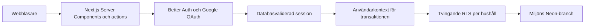

# Arkitektur

## Översikt

Next.js App Router hanterar UI, serverrendering och server actions. Better Auth sköter verifierad e-post/lösenord, Google OAuth och databassessioner. Drizzle ansluter till Postgres, som lagrar både auth- och ekonomidata.

Utveckling och drift använder isolerade Neon-branches med poolade anslutningar. PGlite används för tester och uttryckligt offline-läge. Månadsöversikten läser hushållsdata; kvarvarande fixtures är syntetiska prototyper.

## Säkerhetsgränser

- OAuth- och auth-hemligheter samt databasanslutningar finns bara på servern.
- Proxy-lagret kontrollerar cookien. Skyddade sidor och ändringar validerar alltid sessionen i Better Auths databas.
- Alla Google-konton kan registrera sig. En autentiserad server action skapar användarens eget ägarhushåll efter första inloggningen.
- Lösenordskonton kräver verifierad e-post. Google länkas bara till ett befintligt konto med samma lokalt verifierade adress.
- OAuth-token krypteras med auth-hemligheten. OAuth-state är engångsposter i databasen.
- Previews använder OAuth Proxy via produktionsdomänen. En separat proxyhemlighet delas med Production för kortlivade profiler; auth-hemligheter och databaser är separata.
- Resend skickar verifierings- och återställningsmejl från servern. API-nyckeln lämnar aldrig servern.
- Alla hushållstabeller har tvingande RLS för läsning, tillägg, ändring och borttagning.
- Medlemskontroll ligger i schemat `private`. All hushållsdata nås via `withAuthenticatedDatabase()`, som validerar sessionen och sätter `app.user_id` för transaktionen.
- Främmande nycklar och vanliga hushålls-/datumfrågor har index.
- Hemligheter och verkliga ekonomidata får inte checkas in.

## Databas och miljöer

Appen återanvänder en liten pool med prepared statements avstängda för Neons transaktionspoolning.

| Anslutning               | Roll och användning                                                        |
| ------------------------ | -------------------------------------------------------------------------- |
| `DATABASE_URL`           | Poolad, branchspecifik `home_economy_runtime` utan admin- eller RLS-bypass |
| `DATABASE_MIGRATION_URL` | Direkt ägaranslutning, endast för migrationer                              |

App och migrationsverktyg läser samma lokala miljöfiler. Saknad `DATABASE_URL` ger fel. PGlite kräver `DATABASE_PROVIDER=pglite` och är förbjudet i drift.

Ett Neon-projekt i AWS Frankfurt innehåller tre miljöer:

- `production`: rotbranch för produktion.
- `development`: långlivad branch för staging och previews.
- `dev/alexander`: lokal utveckling, skapad från tom stagingdatabas.

Konton och sessioner är separata per branch. PR:er får inga egna databasbranches av kostnadsskäl. Lokala anslutningar finns i Git-ignorerade `.env.local`, hostade runtime-anslutningar i Vercel och migrationsanslutningar i GitHub environments.

`pnpm db:check` testar auth-lagring, runtime-roll, tvingande RLS och transaktionsisolering i Neon; testdata rullas tillbaka. PGlite ger snabba lokala tester. Google-inloggning och Vercels OAuth-proxy behöver även testas i webbläsaren.

Bakgrund: [plattform](adr/0001-data-and-auth-platform.md), [databasreleaser](adr/0002-database-aware-releases.md) och [appversionering](adr/0003-app-versioning-and-github-releases.md).

## Deploy

GitHub Actions sköter produktion och previews efter godkända kvalitets- och webbläsartester. Vercels automatiska Git-deploys är avstängda för alla branches.

**Produktion:** bygg i Vercel utan att flytta domänen, migrera med ägaranslutningen, kör `db:check` med runtime-rollen och smoketesta inloggningssidan. Först därefter flyttas domänen till nya bygget (promotion). Ett separat jobb publicerar GitHub Release för en ny SemVer-version i `package.json`. Hela produktionskörningar köas.

**Preview:** `Deploy preview` migrerar `development`, kör `db:check`, deployar i Vercel och smoketestar inloggningssidan. Test och deploy använder samma PR-mergecommit. Jobbet använder GitHub-miljön `staging`, köas över alla PR:er och avbryts inte av nya commits under migration.

Preview-jobbet sparar runtime-anslutningen som krypterad, branchspecifik variabel i Vercel. Ägaranslutningen stannar i GitHub Actions migrationssteg. Vercels API används direkt för projektbegränsade tokens utan CLI:ts användaruppslag. Jobbet verifierar GitHub-kopplingen och väntar på `READY` för rätt projekt och testad commit.

Bara PR:er från samma repo, utom Dependabot, får preview-jobbet. En obligatorisk kontroll stoppar externa ändringar av databas-, release- och CI-filer utan stagingvalidering. Previews delar schema och data. Motstridiga migrationer måste samordnas. Migrationer och branchspecifika Vercel-variabler finns kvar efter stängd PR.

Använd expand/contract för att hålla föregående appversion kompatibel om promotion uteblir. Se [release-runbooken](release-runbook.md) för felhantering och begränsningar vid återgång.

## Pengar och datum

Beräkningar använder heltals-öre; Postgres använder `numeric(14,2)`. Månadsperioder lagras som månadens första dag och valideras i databasen. Datum utan tid använder `date`, auditfält `timestamptz`.

### Inkomster

`household_incomes` lagrar namn, månadsbelopp, startmånad och valfri slutmånad. Båda gränsmånaderna ingår. Inställningarna hanterar flera källor; översikten summerar månadens aktiva inkomster.

Valfri inkomst vid hushållsskapande gäller från aktuell månad i Sverige, utan slutdatum. Upprepad onboarding skapar inga nya inkomster.

Äldre `monthly_plans` bevaras som inkomster för respektive månad. `household_member_income` kopieras till inkomster utan slutdatum från månaden för senaste uppdateringen (`Europe/Stockholm`); tidigare giltighet är okänd. Den gamla tabellen behåller RLS men används inte för nya inkomster. All åtkomst går via `withAuthenticatedDatabase()` och tvingande RLS.

### Utgifter och sparande

Poster har startmånad och valfri slutmånad som ingår i perioden. Vid ändring från en senare månad avslutas gamla raden månaden före och en ny skapas i samma autentiserade transaktion. Raden låses för att undvika överlapp vid samtidiga anrop.

Ändring i en avslutad period påverkar bara den perioden, inte senare versioner. Avslut från startmånaden döljer hela perioden; annars behålls tidigare månader. Länkad planhistorik och tidigare utgiftsägare bevaras. Månads- och årsöversikten summerar bara månadens giltiga poster.

Migration 0010 lägger till nullable datumfält och constraints. Äldre sparande utan startmånad gäller även tidigare månader fram till en ändring; okänd historik gissas inte. Borttagna poster förblir dolda. Nytt sparande får vald startmånad.

## Nästa steg

Månadsöversikten visar inkomster, direkta utgifter och avsättningar. Historisk import och kontosnapshots kan läggas till utan att ändra kärnmodellen.
