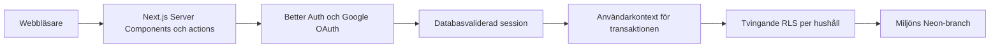

# Arkitektur

## Översikt

Next.js App Router hanterar UI, serverrendering och server actions. Better Auth sköter verifierad e-post/lösenord, Google OAuth och databassessioner. Drizzle ansluter till Postgres, som lagrar både auth- och ekonomidata.

Utveckling och drift använder isolerade Neon-branches med poolade anslutningar. PGlite används för tester och uttryckligt offline-läge. Månadsöversikten läser hushållsdata; kvarvarande fixtures är syntetiska prototyper.

```mermaid
flowchart LR
  Browser["Webbläsare"] --> Next["Next.js Server Components och actions"]
  Next --> Auth["Better Auth och Google OAuth"]
  Auth --> Session["Databasvaliderad session"]
  Session --> Context["Användarkontext för transaktionen"]
  Context --> RLS["Tvingande RLS per hushåll"]
  RLS --> DB["Miljöns Neon-branch"]
```

## Säkerhetsgränser

- OAuth- och auth-hemligheter samt databasanslutningar finns bara på servern.
- Proxy-lagret kontrollerar cookien. Skyddade sidor och ändringar validerar alltid sessionen i Better Auths databas.
- Alla Google-konton kan registrera sig. En autentiserad server action skapar användarens eget ägarhushåll efter första inloggningen.
- Lösenordskonton kräver verifierad e-post. Google länkas bara till ett befintligt konto med samma lokalt verifierade adress.
- OAuth-token krypteras med auth-hemligheten. OAuth-state är engångsposter i databasen.
- Previews använder OAuth Proxy via produktionsdomänen. En separat proxyhemlighet delas med Production för kortlivade profiler; auth-hemligheter och databaser är separata.
- Resend skickar verifierings- och återställningsmejl från servern. API-nyckeln lämnar aldrig servern.
- Alla hushållstabeller har tvingande RLS för läsning, tillägg, ändring och borttagning.
- Medlemskontroll ligger i schemat `private`. All hushållsdata nås via `withAuthenticatedDatabase()`, som validerar sessionen och sätter `app.user_id` för transaktionen.
- Främmande nycklar och vanliga hushålls-/datumfrågor har index.
- Hemligheter och verkliga ekonomidata får inte checkas in.

## Databas och miljöer

Appen återanvänder en liten pool med prepared statements avstängda för Neons transaktionspoolning.

| Anslutning               | Roll och användning                                                        |
| ------------------------ | -------------------------------------------------------------------------- |
| `DATABASE_URL`           | Poolad, branchspecifik `home_economy_runtime` utan admin- eller RLS-bypass |
| `DATABASE_MIGRATION_URL` | Direkt ägaranslutning, endast för migrationer                              |

App och migrationsverktyg läser samma lokala miljöfiler. Saknad `DATABASE_URL` ger fel. PGlite kräver `DATABASE_PROVIDER=pglite` och är förbjudet i drift.

Ett Neon-projekt i AWS Frankfurt innehåller tre miljöer:

- `production`: rotbranch för produktion.
- `development`: långlivad branch för staging och previews.
- `dev/alexander`: lokal utveckling, skapad från tom stagingdatabas.

Konton och sessioner är separata per branch. PR:er får inga egna databasbranches av kostnadsskäl. Lokala anslutningar finns i Git-ignorerade `.env.local`, hostade runtime-anslutningar i Vercel och migrationsanslutningar i GitHub environments.

`pnpm db:check` testar auth-lagring, runtime-roll, tvingande RLS och transaktionsisolering i Neon; testdata rullas tillbaka. PGlite ger snabba lokala tester. Google-inloggning och Vercels OAuth-proxy behöver även testas i webbläsaren.

Bakgrund: [plattform](adr/0001-data-and-auth-platform.md), [databasreleaser](adr/0002-database-aware-releases.md) och [appversionering](adr/0003-app-versioning-and-github-releases.md).

## Deploy

GitHub Actions sköter produktion och previews efter godkända kvalitets- och webbläsartester. Vercels automatiska Git-deploys är avstängda för alla branches.

**Produktion:** bygg i Vercel utan att flytta domänen, migrera med ägaranslutningen, kör `db:check` med runtime-rollen och smoketesta inloggningssidan. Först därefter flyttas domänen till nya bygget (promotion). Ett separat jobb publicerar GitHub Release för en ny SemVer-version i `package.json`. Hela produktionskörningar köas.

**Preview:** `Deploy preview` migrerar `development`, kör `db:check`, deployar i Vercel och smoketestar inloggningssidan. Test och deploy använder samma PR-mergecommit. Jobbet använder GitHub-miljön `staging`, köas över alla PR:er och avbryts inte av nya commits under migration.

Preview-jobbet sparar runtime-anslutningen som krypterad, branchspecifik variabel i Vercel. Ägaranslutningen stannar i GitHub Actions migrationssteg. Vercels API används direkt för projektbegränsade tokens utan CLI:ts användaruppslag. Jobbet verifierar GitHub-kopplingen och väntar på `READY` för rätt projekt och testad commit.

Bara PR:er från samma repo, utom Dependabot, får preview-jobbet. En obligatorisk kontroll stoppar externa ändringar av databas-, release- och CI-filer utan stagingvalidering. Previews delar schema och data. Motstridiga migrationer måste samordnas. Migrationer och branchspecifika Vercel-variabler finns kvar efter stängd PR.

Använd expand/contract för att hålla föregående appversion kompatibel om promotion uteblir. Se [release-runbooken](release-runbook.md) för felhantering och begränsningar vid återgång.

## Pengar och datum

Beräkningar använder heltals-öre; Postgres använder `numeric(14,2)`. Månadsperioder lagras som månadens första dag och valideras i databasen. Datum utan tid använder `date`, auditfält `timestamptz`.

### Månadsöversiktens läsmodell

`MonthSelector` är en liten klientkomponent för direktval, föregående/nästa och aktuell månad i Stockholm. Den validerar mot samma periodschema och gör lokal `router.push` med bevarade URL-parametrar och `scroll: false`. React-transitionen styr laddningsstatus och spärrar nya val; kontrollerna behåller fokus genom `aria-disabled`, händelsekontroll och skrivskydd på inmatningen. Serverns bekräftade `period` styr både väljaren och översiktsdata tills nästa svar är klart. Tillfälligt ofullständig inmatning startar ingen navigation. Ingen ny datacache eller ekonomiberäkning finns i väljaren; auth, URL-validering och RLS ligger kvar på servern. Generell navigerings- och felåterkoppling hör till #77.

`getMonthlyOverview(period)` i `src/features/dashboard/monthly-overview.ts` är månadssidans gemensamma läsingång. Den validerar `YYYY-MM` och läser inkomster, utgifter, avräkningar, sparande, hushållspersoner och bekräftade överföringar i en kort, skrivskyddad `REPEATABLE READ`-transaktion via `withAuthenticatedDatabase()`. Samma databasanslutning, ögonblicksbild och transaktionslokala `app.user_id` gäller för samtliga frågor; tvingande RLS och ägarhushållsfiltret behålls. Inställningarna läser inkomster och hushållsmedlemmar separat utan att hämta utgifter eller ägarlänkar.

Läsmodellen väljer månadens giltiga poster och returnerar oformaterade belopp i heltals-öre, inklusive varje posts månadsbelopp, separata tabellsummor och totalt att föra över. Överföringar är månadsavsättningar för utgifter plus avräkningar och sparande. Kvarvarande belopp är inkomst minus dessa poster och direkta utgifter. Saknad inkomst ger `null`; registrerad nollinkomst är ett känt belopp. En betalning från redan reserverade medel dras inte av igen.

Registrerat öronmärkt värde och panelens planuppföljning beräknas med funding-modulens befintliga regler från samma ögonblicksbild. Överföringar knyts till stabil `itemId`, aldrig namn. `occurredOn` styr värdet; `attributionMonth` styr månadens insättningar. Historiska månader använder månadens sista dag; aktuella och framtida månader använder dagens kalenderdatum i `Europe/Stockholm`. Ingående värde måste vara registrerat senast på värdedatumet för att vara känt. Explicit nollvärde och negativa värden behålls. Läsningen skapar inga överföringar och ändrar inte avslutsregler.

Månaden är en rapporteringsperiod över långlivade poster, inte en separat plan eller ett lagrat kontosaldo. React-komponenterna formaterar beloppen och visar månadens poster; de räknar inte om månadsbelopp eller tabellsummor. Gemensamma tabeller för avsatta utgifter, avräkningar och sparande visar månadsbelopp och registrerat värde; direkta utgifter visas separat. Postens detaljer och beloppsceller renderas på servern och skickas som innehåll till en liten interaktiv Sheet-komponent. Den äger en vanlig tabellrad och namnknapp; klick på radens belopp eller tomma yta aktiverar samma knapp. Knappen är detaljöppningens enda tangentbordsmål och får tillbaka fokus när panelen stängs. Radaktivering ignorerar andra kontroller, portalinnehåll, textmarkering/kopiering, modifierade klick och pointergester som dragning eller scrollning. Datum, ägare, avräkningarnas prognoser och full registreringshistorik nås i panelen. Månadsnyckeln återställer panelen vid månadsbyte; navigering lämnar vyn. Registreringslänken använder stabil postidentitet för ankaret i `/transfers`.

Integrationstesterna i `monthly-overview.test.ts` använder PGlite, verkliga frågor och en begränsad RLS-roll. De täcker transaktionsläge, hushållsisolering inklusive överföringshistorik, historiska värdedatum, Stockholms månadsskifte, saknade/nollställda startvärden, negativt värde, stabil identitet vid namnbyte, avrundning, avslut följt av en separat post med annan typ och avräkningarnas sista överföring. `pnpm db:check` verifierar runtime-åtkomst och RLS på utvecklingsbranchen eller i staging; PGlite ersätter inte denna kontroll.

### Hushållsmedlemmar

`src/features/households/members/` äger validering, ikonfärger, standardfärger, unika namn inom hushållet och skapande, ändring och borttagning av medlemmar. Skrivningar går genom `withAuthenticatedDatabase()` och låser hushållsraden för att samordna standardfärger och namnkontroller. Modulen validerar även utgifternas ägarval och sammanställer ägarprojektioner inom budgetläsningens befintliga transaktion.

Medlemmar är namn för utgiftsägarskap och skapar inga konton eller åtkomsträttigheter. Namn- och färgändringar gäller även tidigare månaders ägarvisning. Borttagning rensar ägarlänkar men bevarar utgifterna. Inställningarna använder modulens smala medlemsläsning och budgetens inkomstläsning; de laddar inga utgifter.

### Inställningarnas läsmodell

`getSettingsData(searchParams)` i `src/features/settings/data.ts` samordnar hushåll, inkomster, medlemmar och standardfärg, kontoinställningar, aktuell månad, återkoppling från kontolänkning och versionsinformation. Inställningssidan konsumerar resultatet och ansvarar för presentationen. De smala autentiserade läsningarna körs parallellt; hushållsdata går fortsatt genom `withAuthenticatedDatabase()` och tvingande RLS. Kontolänkningsstatus visas endast för `success` eller `error`. Modulen är server-only och läser inga utgifter eller ägarlänkar.

### Inkomster

`household_incomes` lagrar namn, månadsbelopp och inkluderande giltighetsdatum. Inställningarna hanterar flera källor; översikten summerar beloppen som gäller på respektive planerad dag. Inkomster är budgetunderlag, inte bekräftade insättningar eller ett bankkontosaldo.

Valfri inkomst vid hushållsskapande gäller från aktuell månad i Sverige, utan slutdatum. Upprepad onboarding skapar inga nya inkomster.

Äldre `monthly_plans` bevaras som inkomster för respektive månad. `household_member_income` kopieras till inkomster utan slutdatum från månaden för senaste uppdateringen (`Europe/Stockholm`); tidigare giltighet är okänd. Den gamla tabellen behåller RLS men används inte för nya inkomster. All åtkomst går via `withAuthenticatedDatabase()` och tvingande RLS.

### Utgifter och sparande

Inkomster, utgifter och sparande använder det gemensamma skrivprotokollet `features/periods/write.ts`. Det låser vald rad och dess stabila identitet, kontrollerar revision, skiljer rättelse från en ny version och bevarar senare versioner. Vid en ny ändring avslutas den tidigare versionen dagen före. Domänadaptrarna behåller utgiftsägare, avräkningsunderlag och sparandets övriga fält.

Utgiftstypen väljs vid skapande och är låst vid både ändring och rättelse. Utgiftsadaptern jämför formulärets typ med den låsta radens `destination` innan skrivprotokollet ändrar datum, revision eller ägarkopplingar. UI:t visar befintlig typ som text och skickar den i ett dolt fält; serverkontrollen skyddar även manipulerade anrop. En annan typ kräver avslut och en separat post med egen identitet. Registrerade pengar och överföringar stannar på den gamla posten. Avslut gäller den valda versionen och bevarar senare versioner; båda posterna kan påverka övergångsmånadens planbelopp enligt sina egna giltighetsdatum och planerade dagar. Se [ADR 0005](adr/0005-locked-expense-types.md).

Månadsöversikten skiljer versionen vid månadsslutet från beloppet på den planerade dagen. Datumet är individuellt, med hushållets standarddag per typ för nya poster. Korta månader använder sista dagen. Ingen dagsproportionering görs. Datum, tidigare/nytt värde och avslut visas i månaden; `/history` ger åtkomst till tidigare och kommande versioner. Avslut från versionens start döljer hela versionen; senare avslut bevarar tidigare dagar. Framtida versioner och registrerade överföringar påverkas inte.

Migration 0014 lägger till exakta datum, revision, planerad dag, `financial_items` och `confirmed_transfers`. Äldre månadsgränser bevaras som fallback (slutmånad till månadens sista dag). Äldre versioner saknar tillförlitliga länkar och kopplas därför inte ihop efter namn; identitet tilldelas vid första ändring eller överföring. Okänt startdatum förblir okänt. Borttagna poster förblir dolda.

### Bekräftade överföringar

`features/funding` äger registrering och uppföljning av manuellt bekräftade insättningar, uttag och ingående värde per ändamål. `/transfers` visar planerat, insatt och kvar/över plan samt öronmärkt värde idag och vid vald månads slut. Förväntningar beräknas utan att skapa väntande transaktionsrader. Inga pengar flyttas automatiskt.

Utfört datum styr historiskt värde; separat ”avser månad” styr endast planuppföljning. Flera överföringar och valfria faktiska belopp stöds. Ingående värde och uttag räknas inte som månadens insättning. Saknat ingående värde betyder noll, aldrig summerad historisk plan. Negativt värde kräver explicit bekräftelse. Gemensam identitetslåsning och idempotenta registrerings-id skyddar mot samtidiga/dubbla bekräftelser. Nya tabeller har tvingande RLS och sammansatta hushållsreferenser. Se [ADR 0004](adr/0004-effective-dates-and-confirmed-transfers.md).

### Avräkningar

Domänens engelska namn är **Replacement Reserve** och **Replacement Contribution**, med svenska visningsnamn enligt [CONTEXT.md](../CONTEXT.md). Befintliga identifierare som `settlement`, `settlementInOre` och `SettlementsSection` är tekniska namn för samma område, inte en separat domänbetydelse. Den nya läsmodellen använder `replacementReserves` och `replacementContributionsInOre`. Inga tabeller, enumvärden eller historiska migrationer döps om i denna refaktorering.

Avräkningar lagras i `recurring_items` med destination `settlement` och använder samma ägare, versionshistorik och tvingande RLS som andra utgifter. Migration 0013 lägger till beräkningsstart, påslag i kronor eller procent samt årlig inflation. `null` betyder att respektive justering är avstängd.

Målbeloppet är `(kostnad + påslag) × (1 + inflation / 100)^(månader / 12)`, avrundat till öre. Månader räknas från planens startmånad till nästa utgiftsmånad. Avsättningen fördelas från startmånaden till månaden före utgiften, minst en månad. De sista överföringarna justeras så att summan blir exakt målbeloppet. Standardvärdena i formuläret är 10 procent påslag och 2 procent inflation; båda kan stängas av.

Avsättningen upphör i utgiftsmånaden (efter startmånaden för en plan som betalas samma månad). Posten finns kvar för hantering. Ett nytt utgiftsdatum startar en ny plan från vald ändringsmånad. Om datumet behålls bevaras beräkningsstarten, så en namnändring inte höjer månadsavsättningen. Det är en budgetplan, inte ett kontosaldo: faktiska insättningar, uttag och avkastning räknas inte av. Avräkningar räknas en gång bland utgifterna och visas separat under överföringar.

## Nästa steg

Månadsöversikten och manuell uppföljning finns. Verkliga bankkontosaldon, automatisk bankintegration, förfallna betalningar, investeringsavkastning och nettoförmögenhet ingår inte. Produktionsmigrationer och `pnpm db:check` passerade för version 0.9.1 den 2026-10-02. Vid nya miljöer och releaser krävs fortsatt migrationer och verifiering med miljöns runtime-roll; lokal PGlite-verifiering ersätter inte denna kontroll.
